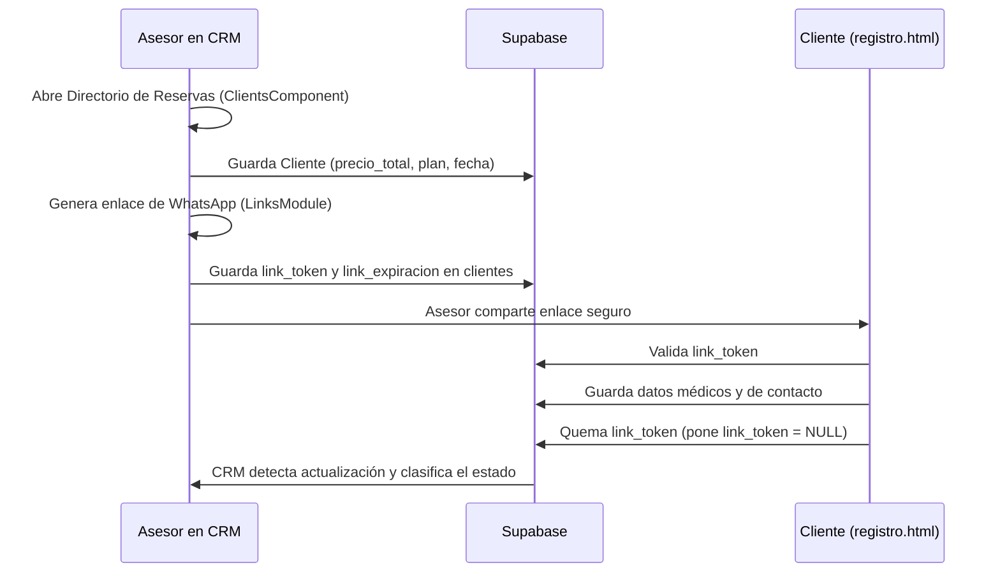
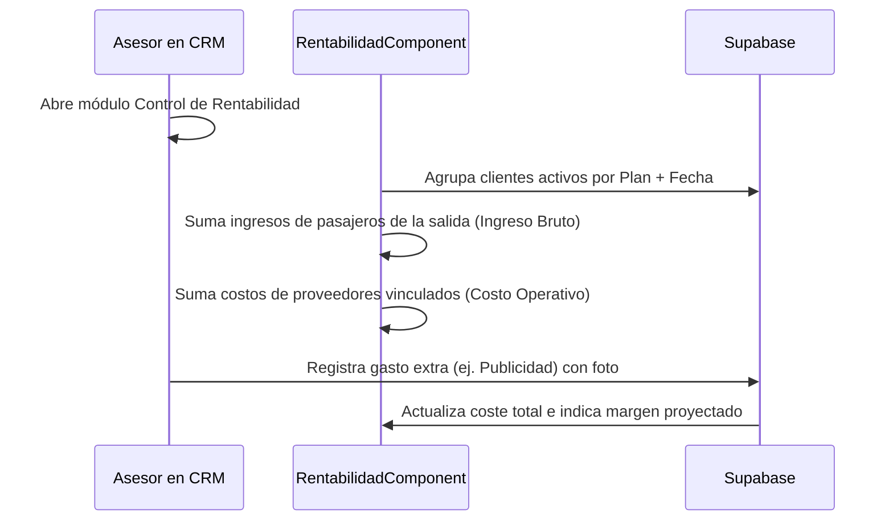

# DOCUMENTACIÓN COMPLETA DEL SISTEMA CRM — VIVE TRAVEL
Este documento describe detalladamente la arquitectura, los flujos, las bases de datos y la lógica de negocio del CRM de Vive Travel, basado en un análisis exhaustivo del código fuente.

---

## SECCIÓN 1 — Visión general del sistema

### Propósito de Negocio
El sistema de **Vive Travel** es una solución CRM (Customer Relationship Management) y ERP (Enterprise Resource Planning) a la medida de una agencia de viajes. Su propósito principal es:
1. **Gestión de Reservas y Clientes:** Administrar los datos demográficos y de contacto de los clientes nacionales e internacionales, junto con el estado de sus reservas.
2. **Control Financiero y Unit Economics:** Registrar ingresos por ventas, calcular comisiones, realizar seguimientos de abonos, registrar gastos y determinar la rentabilidad detallada de cada salida grupal programada.
3. **Distribución de Dividendos:** Administrar la bóveda de socios (Partners Vault), calculando la distribución equitativa de las utilidades corporativas ordinarias y extraordinarias (por ejemplo, del canal B2B) de acuerdo con los porcentajes de aportación de capital.
4. **Documentación Legal y Soportes:** Emitir de forma automatizada comprobantes de pago, recibos oficiales de abonos y cotizaciones estructuradas listas para exportar a PDF o enviar a través de WhatsApp.

### Estructura del Proyecto
El proyecto está estructurado como una aplicación web modular Single Page (SPA) que no requiere de bundlers ni de frameworks complejos de backend:

```text
CRM-Viajes/
│
├── index.html                               # Aplicación principal y contenedor general
├── registro.html                            # Página externa para que el cliente haga check-in
├── server.js                                # Servidor Node.js nativo (servicios estáticos, logs, Resend)
├── package.json                             # Dependencias y scripts de ejecución
│
├── css/
│   ├── base.css                             # Estilos base y tokens
│   ├── components.css                       # Diseño de componentes de UI
│   ├── trazabilidad.css                     # Estilos visuales del historial y auditoría
│   └── utilities.css                        # Clases de utilidad
│
├── js/
│   ├── main.js                              # Orquestador del sistema (puente global)
│   ├── modules/
│   │   ├── app.navigator.js                 # Enrutador e inicializador dinámico
│   │   ├── auth.module.js                   # Módulo de Autenticación con Supabase
│   │   ├── b2b.module.js                    # Módulo de Deals y Ecosistema B2B
│   │   ├── bitacora.module.js               # Conector para registro de logs
│   │   ├── calendar.module.js               # Módulo de Calendario Operativo
│   │   ├── config.module.js                 # Ajustes y asignación de roles
│   │   ├── dispatch.module.js               # Módulo de alertas terrestres y despacho
│   │   ├── links.module.js                  # Generador de tokens y links de WhatsApp
│   │   └── search.module.js                 # Buscador global rápido
│   │
│   ├── services/
│   │   └── supabase.service.js              # Inicializador de Supabase y caché DataService
│   │
│   └── utils/
│       ├── format.utils.js                  # Utilidades de formato (moneda, fecha)
│       └── ui.utils.js                      # Métodos para modales, delete global y notificaciones
│
└── src/
    ├── core/
    │   └── store.js                         # Reactividad centralizada (Single Source of Truth)
    │
    └── components/
        ├── auditoria/                       # Visualización de logs del sistema
        ├── clients/                         # Gestión de clientes y reservas (el módulo más grande)
        ├── contacts/                        # Directorio de leads y prospectos
        ├── dashboard/                       # Métricas financieras y gráficos interactivos
        ├── documentos/                      # Gestión de plantillas y exportación a PDF
        ├── internacionales/                 # Gestión de pasajeros internacionales
        ├── notifications/                   # Envío de alertas de viaje y correos
        ├── partners/                        # Distribución de utilidades y bóveda de socios
        ├── planes/                          # Catálogo de planes y cotizaciones base
        ├── rentabilidad/                    # Registro de egresos y cálculo de márgenes
        ├── suppliers/                       # Directorio y catálogo de proveedores
        └── trazabilidad/                    # Historial y auditoría técnica
```

### Tecnologías y Librerías Externas
- **TailwindCSS (v3):** Framework CSS de utilidad (inyectado vía CDN en la cabecera).
- **Supabase Client Library (v2):** Interacción directa con la base de datos Postgres y almacenamiento (Storage).
- **Chart.js:** Visualización gráfica de ingresos negociados vs. recaudación real.
- **Phosphor Icons:** Biblioteca tipográfica de iconos.
- **html2pdf.js:** Compilación de la estructura DOM para exportar PDF directamente en el cliente.
- **Resend API:** Servicio de entrega de correos electrónicos para el control de alertas diarias.

### Flujo General del Sistema
1. **Acceso:** El usuario inicia sesión a través del panel principal ([index.html](file:///c:/Users/gatuz/OneDrive/Desktop/CRM-Viajes/index.html)).
2. **Carga Inicial:** Se valida la sesión con Supabase Auth y se solicita el perfil de usuario.
3. **Caché y Caché Local:** El archivo [supabase.service.js](file:///c:/Users/gatuz/OneDrive/Desktop/CRM-Viajes/js/services/supabase.service.js) descarga en segundo plano todas las tablas utilizando `Promise.all` y almacena los resultados en `DataService` y `Store.state`.
4. **Enrutamiento:** [app.navigator.js](file:///c:/Users/gatuz/OneDrive/Desktop/CRM-Viajes/js/modules/app.navigator.js) lee la última vista activa del `localStorage` (por defecto, `dashboard`) y muestra la sección correspondiente ocultando el cargador global.
5. **Acciones:**
   - Si se agrega una reserva, `ClientsComponent` guarda el registro en la base de datos de Supabase y actualiza el `Store` de manera reactiva.
   - La reactividad notifica a todos los componentes suscritos (por ejemplo, el `DashboardComponent` regenera sus gráficos e indicadores).

---

## SECCIÓN 2 — Autenticación y control de acceso

### Proceso de Autenticación
La autenticación se realiza a través de la librería nativa de Supabase (`supabaseClient.auth`) en [auth.module.js](file:///c:/Users/gatuz/OneDrive/Desktop/CRM-Viajes/js/modules/auth.module.js).
1. El usuario introduce sus datos en la pantalla de login (`#login-screen`).
2. Se ejecuta `supabaseClient.auth.signInWithPassword({ email, password })`.
3. Si el login es exitoso, `onAuthStateChange` detecta la señal `'SIGNED_IN'`, asigna `currentUser` y recupera el perfil del usuario en la tabla `perfiles_usuarios`.

### Roles de Usuario y Permisos
Los roles están guardados en la base de datos y se cargan al iniciar la sesión:
- **administrador:** Acceso completo a todos los módulos (`dashboard`, `calendario`, `planes`, `clientes`, `proveedores`, `rentabilidad`, `contactos`, `enlaces`, `configuracion`, `trazabilidad`). Tiene permisos de eliminación física y de configuración de parámetros corporativos.
- **socio_mayoritario:** Acceso a todos los módulos excepto `configuracion` y `trazabilidad`. No tiene permisos para borrar registros permanentemente.
- **socio:** Acceso a los módulos comerciales y financieros básicos (`dashboard`, `calendario`, `planes`, `clientes`, `rentabilidad`, `contactos`, `enlaces`).
- **analista (o vendedor):** Rol limitado. Solo puede ver `dashboard`, `calendario`, `clientes` y `enlaces`.

### Lógica de Protección de Rutas
Cuando el usuario intenta cambiar de sección, `window.App.navigate(viewIdentifier)` valida si el rol del usuario cuenta con el identificador en su array `modulos_permitidos`:
```javascript
if (rol !== 'administrador' && !modulosPermitidos.includes(viewIdentifier) && viewIdentifier !== 'dashboard' && viewIdentifier !== 'calendario') {
    UI.showToast("Acceso denegado: Tu rol no tiene permisos para esta área.", "error");
    viewIdentifier = 'dashboard';
}
```
Además, la sección de `trazabilidad` tiene una restricción explícita por correo: solo el correo principal `trespa.paginas@gmail.com` puede acceder a este módulo.

---

## SECCIÓN 3 — Módulos del sistema

### 1. Dashboard (Consola Financiera)
- **Propósito:** Ofrecer visualizaciones estadísticas del estado contable (ingresos brutos negociados, costo operativo base, utilidades de la agencia, abonos reales recaudados y deudas de cartera).
- **Archivos:** [dashboard.component.js](file:///c:/Users/gatuz/OneDrive/Desktop/CRM-Viajes/src/components/dashboard/dashboard.component.js)
- **Funciones clave:**
  - `updateKPIs()`: Filtra reservas y gastos según el periodo de tiempo seleccionado y calcula ingresos totales, montos recaudados, cartera pendiente y tasa de cancelación.
  - `renderActivePlans(planStats)`: Rinde tarjetas de desempeño específicas para cada salida con más de 3 pasajeros.
  - `renderRealCharts(planStats)`: Inicializa y actualiza los gráficos de barras y de dona usando Chart.js.
- **Tablas:** `clientes`, `abonos`, `planes`, `gastos_salidas`.
- **Interacciones:** Selector de rango de tiempo (`data-action="update-dashboard-range"`), que actualiza los KPIs para: "Hoy", "Últimos 7 días", "Mes en curso" o "Año en curso".

### 2. Calendario Operativo
- **Propósito:** Mostrar las salidas grupales programadas en un calendario interactivo.
- **Archivos:** [calendar.module.js](file:///c:/Users/gatuz/OneDrive/Desktop/CRM-Viajes/js/modules/calendar.module.js)
- **Funciones clave:**
  - `init()`: Dibuja la cuadrícula del mes actual.
  - `renderCalendar()`: Mapea los rangos de fechas de salida de los planes asignados a los clientes.
- **Tablas:** `clientes`, `planes`.

### 3. Catálogo de Planes
- **Propósito:** Configurar la tarifa de venta sugerida, el destino, las fechas de salidas grupales y los costos bases parametrizados de los paquetes comerciales.
- **Archivos:** [planes.component.js](file:///c:/Users/gatuz/OneDrive/Desktop/CRM-Viajes/src/components/planes/planes.component.js)
- **Funciones clave:**
  - `renderGrid()`: Genera las fichas de los planes del catálogo en base a la vista actual (cuadrícula/lista) y los filtros aplicados.
  - `savePlan()`: Lee los campos del modal de creación de planes y los almacena en Supabase.
  - `switchPlanesView(viewType)`: Alterna la interfaz gráfica entre tarjetas o filas de lista compactas.
- **Tablas:** `planes`, `proveedores`.

### 4. Directorio de Reservas
- **Propósito:** El módulo más grande de la aplicación. Maneja el estado individual de cada reserva, el registro de los datos de los pasajeros, sus acompañantes y la recepción de abonos.
- **Archivos:** [clients.component.js](file:///c:/Users/gatuz/OneDrive/Desktop/CRM-Viajes/src/components/clients/clients.component.js)
- **Funciones clave:**
  - `renderTable()`: Genera el listado estructurado de clientes en base a filtros (Estado, Vendedor, Destino, Buscador rápido).
  - `saveCliente()`: Inserta o actualiza un registro en Supabase. Si la reserva tiene acompañantes asignados en el modal, los actualiza o los crea vinculándolos mediante `parent_id`.
  - `openAbonoModal(clienteId)`: Abre la ventana para registrar transacciones de pago sobre una reserva seleccionada.
- **Tablas:** `clientes`, `abonos`, `planes`.

### 5. Directorio de Proveedores
- **Propósito:** Registrar los operadores turísticos aliados, hoteles y servicios de guianza, configurando su catálogo de productos y precios unitarios.
- **Archivos:** [suppliers.component.js](file:///c:/Users/gatuz/OneDrive/Desktop/CRM-Viajes/src/components/suppliers/suppliers.component.js)
- **Funciones clave:**
  - `saveSupplier()`: Guarda el registro maestro del proveedor.
  - `saveProductRow()`: Agrega servicios específicos al JSON de catálogo del proveedor.
- **Tablas:** `proveedores`.

### 6. Ecosistema B2B (Alianzas)
- **Propósito:** Gestionar propuestas de negocio y alianzas corporativas de mayoreo.
- **Archivos:** [b2b.module.js](file:///c:/Users/gatuz/OneDrive/Desktop/CRM-Viajes/js/modules/b2b.module.js)
- **Funciones clave:**
  - `saveDeal()`: Crea o actualiza un negocio vinculado a una alianza B2B.
  - `renderFinanzas()`: Reporta las utilidades totales del canal B2B y calcula la repartición proyectada a los socios.
- **Tablas:** `b2b_aliados`, `b2b_servicios_catalogo`, `b2b_negocios`.

### 7. Directorio de Contactos
- **Propósito:** Guardar información preliminar de clientes potenciales (Leads) que se encuentran en etapa de preventa.
- **Archivos:** [contacts.component.js](file:///c:/Users/gatuz/OneDrive/Desktop/CRM-Viajes/src/components/contacts/contacts.component.js)
- **Funciones clave:**
  - `saveContact()`: Guarda o modifica el prospecto en la base de datos.
- **Tablas:** `contactos`.

### 8. Configuración del Sistema
- **Propósito:** Administración de la marca corporativa y asignación de roles.
- **Archivos:** [config.module.js](file:///c:/Users/gatuz/OneDrive/Desktop/CRM-Viajes/js/modules/config.module.js)
- **Funciones clave:**
  - `loadSecurityProfiles()`: Genera la lista de perfiles y permite a los administradores reasignar roles mediante selectores dinámicos.
  - `crearNuevoVendedor(event)`: Invoca una función Edge de Supabase para registrar usuarios en el sistema de autenticación de Supabase (bypass del flujo administrativo).
- **Tablas:** `perfiles_usuarios`.

### 9. WhatsApp de Ventas (Enlaces)
- **Propósito:** Generar enlaces cifrados con tokens y expiración para que los asesores envíen a los clientes por chat, permitiendo el autoregistro (check-in) del pasajero.
- **Archivos:** [links.module.js](file:///c:/Users/gatuz/OneDrive/Desktop/CRM-Viajes/js/modules/links.module.js)
- **Funciones clave:**
  - `generateToken(clienteId)`: Crea un string hash aleatorio, le asigna 24 horas de validez en Supabase, y genera el enlace apuntando a `registro.html?token=...`.
- **Tablas:** `clientes`.

### 10. Rentabilidad y Salidas
- **Propósito:** Registrar costos operativos extras por salida grupal (Publicidad, Guías, Comisiones, Alimentación extra) y auditar el margen unitario final.
- **Archivos:** [rentabilidad.component.js](file:///c:/Users/gatuz/OneDrive/Desktop/CRM-Viajes/src/components/rentabilidad/rentabilidad.component.js)
- **Funciones clave:**
  - `renderGrid()`: Agrupa las reservas de los clientes por plan e itinerario, deduciendo el margen proyectado (Ingreso Bruto de la salida - Suma de gastos).
  - `saveGasto(e)`: Almacena un egreso asignado a un viaje, obligando al usuario a subir una foto del comprobante de soporte.
- **Tablas:** `clientes`, `gastos_salidas`, `planes`.

### 11. Directorio Internacional
- **Propósito:** Gestión y auditoría contable de reservas internacionales que manejan comisiones e integran listados de pasajeros de forma embebida.
- **Archivos:** [internacionales.component.js](file:///c:/Users/gatuz/OneDrive/Desktop/CRM-Viajes/src/components/internacionales/internacionales.component.js)
- **Funciones clave:**
  - `saveInternacional()`: Guarda la reserva con tipo `'Internacional'`. Consolida los pagos de los pasajeros y genera ajustes en la tabla `abonos` en base a diferencias de dinero.
- **Tablas:** `clientes`, `abonos`, `planes`.

### 12. Documentos y Soportes (Biblioteca)
- **Propósito:** Crear plantillas y editar cotizaciones o recibos oficiales en formato digital de alta calidad.
- **Archivos:** [documentos.component.js](file:///c:/Users/gatuz/OneDrive/Desktop/CRM-Viajes/src/components/documentos/documentos.component.js)
- **Funciones clave:**
  - `loadFromReserva(id)`: Autocompleta el editor cargando la información de la reserva seleccionada, sus abonos oficiales confirmados y los servicios incluidos del plan.
  - `saveActiveDocument()`: Registra el borrador del documento en una biblioteca compartida para evitar duplicación.
- **Tablas:** `documentos_guardados`, `clientes`, `abonos`, `planes`.

### 13. Trazabilidad y Auditoría
- **Propósito:** Visualizar auditorías detalladas de los cambios de estados de las reservas y el historial de transacciones.
- **Archivos:** [trazabilidad.component.js](file:///c:/Users/gatuz/OneDrive/Desktop/CRM-Viajes/src/components/trazabilidad/trazabilidad.component.js)
- **Tablas:** `historial_reservas`.

### 14. Alertas de Salidas (Notificaciones)
- **Propósito:** Mostrar los viajes que requieren check-in de datos médicos o tienen saldos en mora según el número de días que faltan para la salida.
- **Archivos:** [notifications.component.js](file:///c:/Users/gatuz/OneDrive/Desktop/CRM-Viajes/src/components/notifications/notifications.component.js)
- **Funciones clave:**
  - `sendWeeklyAlertsEmail()`: Envía el reporte diario/semanal invocando el servicio Resend a través del servidor nativo `/send-alerts-email`.
- **Tablas:** `clientes`, `alertas_gestionadas`.

---

## SECCIÓN 4 — Flujos de datos entre módulos

### Flujo A: Creación de Reserva e Inicio de Flujo de Pago

1. El asesor crea la reserva en el módulo **Directorio de Reservas** (`ClientsComponent`), guardando el plan asignado, las fechas y la tarifa acordada en la tabla `clientes`.
2. El asesor pulsa "Generar Link" en el módulo **Ventas por WhatsApp** (`LinksModule`). Esto inserta en la fila del cliente en Supabase un token seguro y una fecha de caducidad.
3. El asesor envía el link por WhatsApp. El cliente ingresa a `registro.html?token=...`, el cual valida el token en Supabase, recupera los datos básicos y carga el formulario.
4. El cliente acepta los términos legales y rellena el formulario de check-in (EPS, contacto de emergencia, alergias, edad).
5. Al hacer submit, el script de `registro.html` actualiza la fila del cliente en la base de datos, quema el token (borrando `link_token`) y cambia el estado de la reserva a `'confirmado'` (si el saldo restante es cero) o `'proceso de pago'`.
6. En el CRM principal, la reactividad del `Store` actualiza la tabla de clientes.

### Flujo B: Liquidación y Cálculo de Rentabilidad de Salidas Grupales

1. Al acceder al módulo **Control de Rentabilidad** (`RentabilidadComponent`), el sistema lee de `DataService.clientes` y agrupa dinámicamente las reservas que comparten el mismo `plan_id` y `fecha_viaje`.
2. Para cada salida grupal, calcula:
   * **Ingreso Bruto:** Suma del precio total de los pasajeros (excluyendo reprogramados o desistidos).
   * **Costo Operativo Base:** Suma del costo base parametrizado de los planes asignado a cada pasajero.
3. El asesor agrega un egreso extra (por ejemplo, comisión a vendedor o pago a transportador) desde la UI. El formulario obliga a adjuntar una foto que es subida a Supabase Storage (`comprobantes`).
4. Al completarse el registro del gasto en la tabla `gastos_salidas`, se recarga la base de datos y la utilidad operativa real del viaje se actualiza instantáneamente en el **Dashboard** y en la tabla de rentabilidad.

---

## SECCIÓN 5 — Base de datos (Supabase)

### Tablas del Sistema
1. **clientes:**
   - **Propósito:** Registro principal de pasajeros y reservas.
   - **Campos críticos:** `id` (uuid), `nombre`, `apellido`, `documento`, `telefono`, `email`, `plan_id` (relacionado con planes), `fecha_viaje` (string de rango), `precio_total` (numeric), `costo_base` (numeric), `estado` (text), `parent_id` (uuid, autoreferenciada para grupos), `link_token` (text), `link_expiracion` (timestamp), `terminos_aceptados` (boolean), `pasajeros_internacionales` (jsonb), `tipo_reserva` (text).
2. **planes:**
   - **Propósito:** Catálogo maestro de planes de la agencia.
   - **Campos críticos:** `id` (uuid), `nombre`, `destino`, `precio_persona`, `costo_base`, `tipo` (Pasadía, Grupal, Medida), `categoria` (Local/Internacional), `fechas` (jsonb, array de salidas programadas), `proveedores_vinculados` (jsonb, desglose de costos), `servicios_incluidos` (jsonb).
3. **abonos:**
   - **Propósito:** Registro detallado de pagos de clientes.
   - **Campos críticos:** `id`, `cliente_id` (uuid, fk a clientes), `monto` (numeric), `metodo` (text), `estado_pago` (confirmed, pending, refunded), `created_at` (timestamp).
4. **proveedores:**
   - **Propósito:** Directorio y catálogo de prestadores de servicios turísticos.
   - **Campos críticos:** `id`, `nombre`, `tipo`, `productos` (jsonb, listado de servicios del proveedor con costos unitarios).
5. **gastos_salidas:**
   - **Propósito:** Egresos operativos específicos de una salida.
   - **Campos críticos:** `id`, `plan_id`, `fecha_viaje`, `concepto`, `categoria`, `valor` (numeric), `tipo_valor` (fijo/porcentaje), `soporte_url` (text), `justificacion` (text).
6. **perfiles_usuarios:**
   - **Propósito:** Control de acceso basado en roles.
   - **Campos críticos:** `user_id` (uuid, fk a auth.users), `email`, `rol` (text), `modulos_permitidos` (text[]), `puede_eliminar` (boolean), `puede_configurar` (boolean).
7. **socios_config:**
   - **Propósito:** Porcentajes de participación de los socios de la agencia.
   - **Campos críticos:** `id`, `nombre`, `email`, `porcentaje` (numeric).
8. **socios_movimientos:**
   - **Propósito:** Transacciones de aportaciones de capital y retiros de utilidades de socios.
   - **Campos críticos:** `id`, `socio_email` (text), `tipo` (aporte/retiro/payout), `monto` (numeric), `concepto` (text), `origen_fondo` (text).
9. **b2b_aliados**, **b2b_servicios_catalogo**, **b2b_negocios:**
   - **Propósito:** Relaciones de venta institucional y corporativa.
10. **adelantos_operativos:**
    - **Propósito:** Control de caja y anticipos para operadores o guías.
11. **fondos_flotantes:**
    - **Propósito:** Control de cuentas puente o dinero en tránsito.
12. **documentos_guardados:**
    - **Propósito:** Almacenamiento de cotizaciones y soportes editados por el equipo.
13. **historial_reservas:**
    - **Propósito:** Auditoría y log detallado de transacciones y estados.

### Relaciones entre Tablas
- `clientes.plan_id` -> `planes.id`
- `clientes.parent_id` -> `clientes.id` (Relación jerárquica Titular-Acompañante)
- `abonos.cliente_id` -> `clientes.id`
- `perfiles_usuarios.user_id` -> `auth.users.id`
- `b2b_negocios.aliado_id` -> `b2b_aliados.id`
- `b2b_negocios.servicio_id` -> `b2b_servicios_catalogo.id`

---

## SECCIÓN 6 — Lógica de negocio crítica

### Cálculo de PAX Real
Para evitar duplicidad en el conteo de pasajeros en viajes grupales (donde un titular se registra junto a sus acompañantes en filas individuales con un `parent_id` común), el sistema aplica el siguiente algoritmo:
$$PAX = \begin{cases} 
1 & \text{si } \text{Count}(\text{clientes con } parent\_id = c.id) > 0 \\ 
\text{c.pax} & \text{en otro caso} 
\end{cases}$$
Esta lógica está escrita en [rentabilidad.component.js](file:///c:/Users/gatuz/OneDrive/Desktop/CRM-Viajes/src/components/rentabilidad/rentabilidad.component.js) y [partners.component.js](file:///c:/Users/gatuz/OneDrive/Desktop/CRM-Viajes/src/components/partners/partners.component.js) en la función `getClientRealPax(c)`.

### Unit Economics por Salida Grupal
La rentabilidad neta de una salida específica se calcula mediante:
$$\text{Ingreso Bruto} = \sum (\text{precio\_total de clientes activos})$$
$$\text{Costo Base de Reservas} = \sum (\text{Costo Base del Plan} \times \text{PAX Real del Cliente})$$
$$\text{Costos Operativos Extras} = \sum (\text{Gastos Fijos}) + \sum (\text{Gastos Porcentuales} \times \text{Ingreso Bruto})$$
$$\text{Utilidad Operativa Bruta (UB)} = \text{Ingreso Bruto} - \text{Costo Base de Reservas} - \text{Costos Operativos Extras}$$

### Distribución de Utilidades Corporativas (Bóveda de Socios)
La utilidad neta distribuible del periodo ordinario se calcula restando la reserva de fondo a la utilidad de operación de la agencia:
1. **Utilidad de Operación:**
   $$\text{Utilidad de Operación} = \text{Utilidad Bruta de Viajes} - \text{Gastos Administrativos Corporativos}$$
2. **Retención del Fondo de Reserva:**
   $$\text{Retención} = \text{Utilidad de Operación} \times \frac{\text{Porcentaje de Retención (por defecto 10\%)}}{100}$$
3. **Utilidad Neta Distribuable (UN):**
   $$\text{UN} = \text{Utilidad de Operación} - \text{Retención}$$
4. **Dividendo por Socio:**
   $$\text{Pago Socio} = \text{UN} \times \frac{\text{Porcentaje de Participación del Socio}}{100}$$

Si la utilidad bruta es menor a los gastos corporativos del periodo, se declara un estado de **Déficit Corporativo** y la utilidad neta distribuible se establece en $0.

### Reglas de Clasificación Automática de Reservas
Al realizar la carga de los datos (`loadAll()`), el sistema auto-clasifica las reservas de forma exclusiva:
1. **Exclusiones Manuales:** Si el cliente tiene estado `'devolución'`, `'cancelado o devolución'`, `'reprogramado'` o `'desistió'`, se respeta dicho valor sin aplicar reglas.
2. **Reserva Confirmada / Activa:** Si la fecha del viaje es posterior al día de hoy, el cliente se mantiene activo.
3. **Pasado (Viaje Realizado):** Si la fecha del viaje ya ocurrió:
   - Si el total abonado es $\geq 100\%$ del precio pactado, pasa a **Realizadas**.
   - Si el total abonado es $< 100\%$ (mora), pasa automáticamente a **En Caja** (saldo a favor).

---

## SECCIÓN 7 — Inconsistencias y observaciones

A través del análisis detallado del código, se identifican las siguientes deudas técnicas y riesgos de seguridad:

### 1. Parcheo Dinámico de Datos de Configuración de Socios
- **Ubicación:** [partners.component.js](file:///c:/Users/gatuz/OneDrive/Desktop/CRM-Viajes/src/components/partners/partners.component.js), líneas 53–65.
- **Riesgo:** Existe una función patch que sobreescribe dinámicamente en memoria los correos y nombres de socios si detecta coincidencias con correos antiguos de prueba. Esto provoca que si un administrador intenta cambiar los correos o porcentajes desde la base de datos de socios o la UI, la lógica de JS forzará valores estáticos, inutilizando los cambios en la BD.
- **Impacto:** Alta rigidez. El sistema tiene hardcodeados correos y nombres clave como `trespa.paginas@gmail.com` y `luismendezramirez@hotmail.es`.

### 2. Auto-Modificación de Cuentas a "En Caja" en la Carga Inicial
- **Ubicación:** [supabase.service.js](file:///c:/Users/gatuz/OneDrive/Desktop/CRM-Viajes/js/services/supabase.service.js), líneas 64–66.
- **Riesgo:** Cuando se descargan los clientes de la base de datos, el código sobreescribe el estado de los clientes que dicen `'cancelado o devolución'` o `'cancelados'` para establecerlos en `'en caja'`.
- **Impacto:** Confusión contable. Un cliente que fue cancelado legalmente y requiere reintegro se procesa en el resto del CRM como un cliente activo con dinero en caja.

### 3. Puertas Traseras de Acceso por Correo
- **Ubicación:** [auth.module.js](file:///c:/Users/gatuz/OneDrive/Desktop/CRM-Viajes/js/modules/auth.module.js), línea 137 y [app.navigator.js](file:///c:/Users/gatuz/OneDrive/Desktop/CRM-Viajes/js/modules/app.navigator.js), línea 78.
- **Riesgo:** Se comprueba el correo de forma literal contra `'trespa.paginas@gmail.com'` para dar permisos de visualización del botón de trazabilidad y permitir el acceso a auditorías.
- **Impacto:** Si la cuenta del administrador cambia de correo electrónico, se pierde por completo el acceso a este módulo y no se puede recuperar mediante base de datos ni roles, requiriendo un cambio directo en el código fuente.

### 4. Inconsistencia de Clientes Internacionales
- **Ubicación:** [internacionales.component.js](file:///c:/Users/gatuz/OneDrive/Desktop/CRM-Viajes/src/components/internacionales/internacionales.component.js), líneas 445–463.
- **Riesgo:** El módulo de internacionales maneja transacciones confirmadas a través del array JSON `pasajeros_internacionales`. Al guardar, si la suma declarada difiere de los abonos reales, el sistema inserta transacciones artificiales con el concepto `'Consolidación Pago Internacional'`.
- **Impacto:** Posible duplicación de ingresos si los asesores también registran abonos normales de forma manual para esos mismos clientes internacionales.

### 5. Duplicidad de Métodos de Negocio Críticos
- **Ubicación:** Múltiples componentes (por ejemplo, [partners.component.js](file:///c:/Users/gatuz/OneDrive/Desktop/CRM-Viajes/src/components/partners/partners.component.js) línea 20, [rentabilidad.component.js](file:///c:/Users/gatuz/OneDrive/Desktop/CRM-Viajes/src/components/rentabilidad/rentabilidad.component.js) línea 15 y [dashboard.component.js](file:///c:/Users/gatuz/OneDrive/Desktop/CRM-Viajes/src/components/dashboard/dashboard.component.js) línea 130).
- **Riesgo:** El método `getClientRealPax` está repetido de forma idéntica en múltiples archivos individuales. La misma lógica de cálculo de costes base de reservas de clientes también se repite.
- **Impacto:** Si la regla para contar pasajeros o calcular costos base cambia (por ejemplo, soportando pasajeros de valor parcial), se debe modificar individualmente en 3 archivos diferentes, incrementando la probabilidad de inconsistencias en los reportes financieros.
